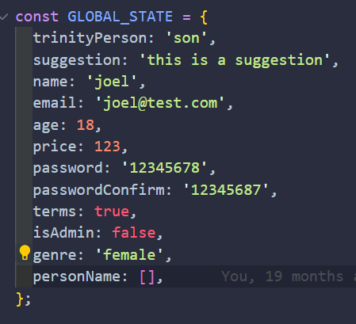
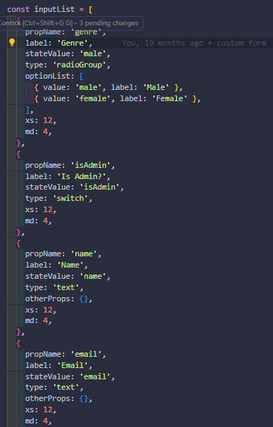
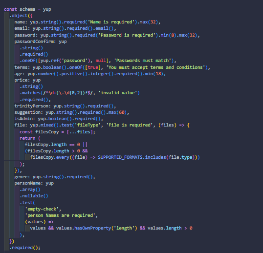
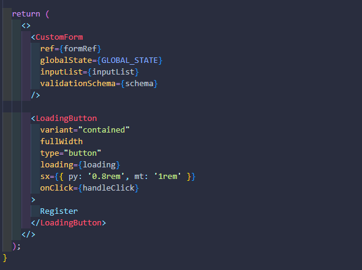

# Generate custom forms with, material UI and react-hook-form

- valid type inputs
  - text
  - number
  - text-area
  - select
  - file input
  - multiselect
  - checkbox
  - switch
  - radio groups

# steps

1. generate a object with initial state of form:

example:

2. generate a input list

example:

3. generate a yup schema validation:

example:

4. build a custom form

